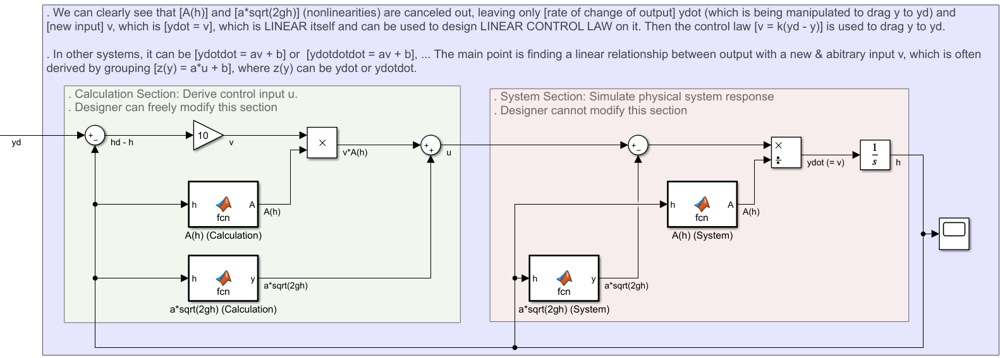
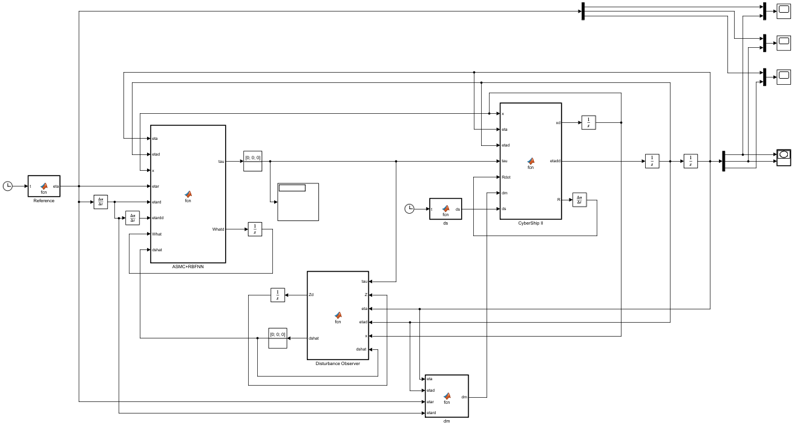

# Control Systems

## Feedback Linearization
* Assumming that we have a NONLINEAR equation: `y(t) = f(u(t))` where `y(t)` in output, `u(t)` is input.
* The first step is deriving a LINEAR equation: `z(t) = a*u(t) + b` where `z(t)` can be easily transformed to `y(t)` (e.g.: `z(t) = dy(t)/dt` )
* The second step is deriving a LINEAR equation: `u(t) = c*v(t) + d` with `v(t)` is a new input. The coefficients `c` and `d` are chosen such that all the nonlinearities (usually all the coefficients) of `z(t)` are cancelled out, leaving a LINEAR equation `z(t) = v(t)`. The new input `v(t)` can then be replaced by a LINEAR controller (which is only applicable in, well, LINEAR equations), like proportional a controller. 
* For example, `z(t)` can be `dy(t)/dt`, thus we have `dy(t)/dt = v(t)`. Replacing the input `v(t)` with any linear controller, like proportional controller `kp*e`, the rate of change `dy(t)/dt` is then adjust in direction with a magnitude such that `y(t)` will go close to `yd` (and `e` is minimized). The output of that linear controller, which is `v(t)`, is then use to derive `u(t)` (from equation `u(t) = a*v(t) + b`) and then `u(t)` is used to derive `z(t)` (from `z(t) = a*u(t) + b`). `z(t) = dy(t)/dt` takes integral to get y(t).
* For example, feedback linearization on a tank:

  

## Sliding Mode Control

### Paper #1: DOI: 10.1109/ACCESS.2020.2977609 - (2020) - Adaptive Sliding Mode Control Design for Nonlinear Unmanned Surface Vessel Using RBFNN and Disturbance-Observer

  

* Adaptive SMC + RBFNN + Disturbance Observer.
* Control Law: tau = -R'(rho+Kv.s+xi.sat+dmhat+dshat) . Where: reaching law = Kv.s+xi.sat, sliding law = the rest.

